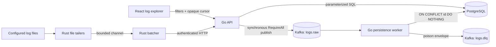

# Architecture

## Runtime data path

The durable delivery boundary begins when Kafka acknowledges publication. Before that point, the agent provides bounded in-memory buffering and retry, but not durable spooling. PostgreSQL is the searchable source of truth; the query path does not read from Kafka.

## Component ownership

| Component | Owns | Does not own |
| --- | --- | --- |
| Rust agent | File polling, rotation/truncation detection, JSON/plain parsing, event IDs, bounded queueing, batching, HTTP retry, local counters | Kafka, database writes, durable source offsets |
| Go API | Bearer authentication, HTTP limits, strict JSON decoding, event validation, synchronous Kafka publication, query parsing, cursor encoding | Kafka consumption, offset commits, persistence retry |
| Kafka | Buffering accepted events between API and worker; `logs.raw` and `logs.dlq` topics | Search or event idempotency |
| Go worker | Sequential consumption, validation, persistence retry, DLQ publication, terminal-state offset commits | HTTP concerns or query behavior |
| PostgreSQL store | Schema constraints, unique event IDs, parameterized inserts and searches | HTTP cursor representation |
| React explorer | Real query/health requests, runtime response validation, filters, cursor continuation, UI states | Ingestion credentials or fabricated summary data |

The Go binaries in `backend/cmd` are composition roots. Interfaces are declared by consumers at broker, store, and HTTP test boundaries; there is no forwarding service/manager hierarchy.

## Event contract

Every Kafka record and persisted row represents schema version 1:

| Field | Meaning |
| --- | --- |
| `id` | Stable for retries performed by one running agent process |
| `timestamp` | Event time normalized to UTC |
| `service` | Configured source service |
| `level` | `trace`, `debug`, `info`, `warn`, `error`, or `fatal` |
| `message` | Original human-readable content |
| `attributes` | Bounded JSON object containing remaining structured fields |
| `source` | String metadata such as agent, host, and file path |

The API bounds the HTTP body and batch, validates each event, and can accept valid events while reporting invalid events as rejected. Kafka messages use the event ID as their key. PostgreSQL repeats the contract with a schema-version check and `id` primary key.

## Collection and batching

Each configured file has one asynchronous tailer. Complete lines are parsed and offered to a bounded `tokio::mpsc` channel with `try_send`; producers never accumulate an unbounded backlog behind HTTP delivery. One batcher owns the receiver and flushes on maximum event count, flush interval, or channel closure.

JSON lines contribute recognized string fields (`message`/`msg`, `level`/`severity`, and RFC3339 `timestamp`/`time`) while preserving all remaining fields in `attributes`. Invalid JSON and plain-text inputs retain the full line as `message`. IDs are assigned before an event enters the queue, so retries reuse the same payload and identity.

## Ingestion and persistence

`POST /v1/ingest` is the only authenticated route. The API strictly decodes one JSON value, applies body/batch/event limits, normalizes accepted events, and calls a synchronous Kafka writer configured with `RequireAll`. A `202` response confirms Kafka acknowledgement, not database persistence.

The worker uses Kafka `FetchMessage` plus explicit `CommitMessages`; automatic periodic commits are disabled. It processes one record at a time so a later offset cannot be committed past an unresolved earlier record in this implementation. A valid event is committed only after an idempotent PostgreSQL insert. An invalid record is committed only after its redacted envelope reaches `logs.dlq`. Retry exhaustion leaves the offset uncommitted and exits the worker.

Detailed guarantees, ambiguity windows, and failure cases are in [delivery-semantics.md](delivery-semantics.md).

## Query path

`GET /v1/logs` reads PostgreSQL directly. It supports exact `service` and `level` filters, PostgreSQL full-text message search through `q`, inclusive RFC3339 `start`/`end` bounds, and a bounded page size. Results are ordered by `(timestamp DESC, id DESC)`. The HTTP layer encodes the final tuple as a versioned opaque cursor; SQL compares the tuple rather than using `OFFSET`.

The React explorer calls `/v1/logs`, `/v1/services`, `/v1/metrics`, `/healthz`, and `/readyz`. It is an optional Compose profile and never receives the ingestion key.

## Operations and deployment boundary

Docker Compose runs one PostgreSQL node, one Kafka KRaft node, topic initialization, checksum-tracked migrations, the API, worker, agent, and optional dashboard. Health-checked dependencies and completed one-shot jobs control startup ordering. Published ports bind to `127.0.0.1`; this is a local development topology, not a high-availability or internet-facing deployment.

Process logs are structured. API, worker, and agent expose fixed-cardinality process counters; API and worker readiness checks their required PostgreSQL/Kafka dependencies. Configuration, health semantics, and exposed ports are detailed in [operations.md](operations.md).

## Deliberate limitations

- no persistent agent checkpoint or disk spool;
- no draining of writes made to a renamed file after rotation;
- no atomic transaction spanning PostgreSQL and Kafka offset commits;
- no DLQ replay tooling or DLQ deduplication;
- no authentication on local query endpoints;
- no TLS, Kafka authentication, monitoring stack, tracing, or HA deployment in Compose.
